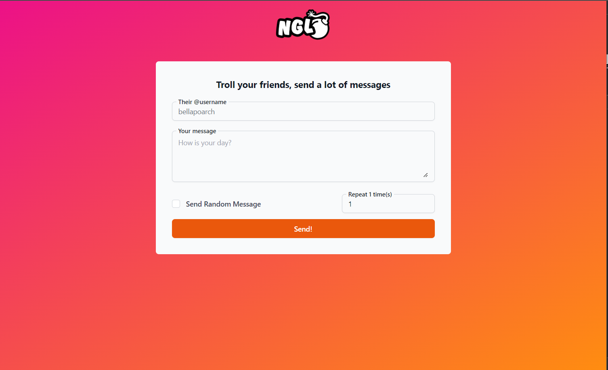

# NGL Bomber

Get ready to flood your NGL Link account with messages! NGL Bomber is the ultimate tool for sending multiple messages in a flash. Built with Vite, ReactJS, TypeScript, and Tailwind CSS, it's the perfect way to have some fun with your friends.

## Deploy Status

## Link

https://ngl-bomber.vercel.app/

## Screenshot

 

## Built With
 - ReactJS Typescript
 - TailwindCSS
 - Vite
 
## Inspiration 

https://github.com/oxitheman/NGL
 
